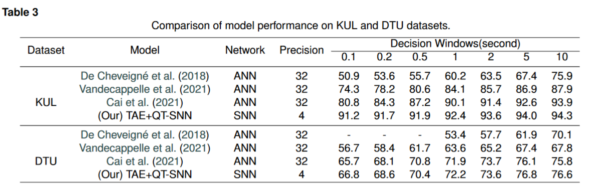

# Spike-EEG-Network

English | [中文(Chinese)](./README_cn.md)
## Data Prepare
Please organize the downloaded datasets as follows, using the [KUL Database](https://zenodo.org/records/4004271) and [DTU Database](https://zenodo.org/records/1199011) as examples:

```
|EEG Database/
├──KUL Dataset/
│  ├── Data
│  │   ├── S1.mat
│  │   ├── S2.mat
│  │   ├── ......
│  ├── ......
├──DTU Dataset/
│  ├── EEG
│  │   ├── S1.mat
│  │   ├── S2.mat
│  │   ├── ......
│  ├── Data_preproc
│  │   ├── ......
│  ├── AUDIO
│  │   ├── ......
|  ├── ......
```

### Data Loader
Next, we will use `EEGLoader.py` to process the datasets, dividing the loaded data into training and testing sets to prepare for subsequent network input.

```
from EEGLoader import EEGDataset
path = r'' # EEG path

train_ratio = 0.8 ## train_set ratio
test_ratio = 0.2 ## test_set ratio

train_set, test_set = EEGDataset(path, train_ratio, test_ratio)
```

The type of `train_set` is `<torchvision.datasets>`. Subsequently, we can use `<torch.utils.data.DataLoader>` to convert the processed results into a format suitable for network training.


```
from torch.utils.data import Dataset,DataLoader

train_loader = DataLoader(dataset=train_dataset, batch_size=32, shuffle=True, num_workers=4, drop_last=True,pin_memory=True)
test_loader=DataLoader(dataset=test_dataset, batch_size=32, shuffle=False, num_workers=4, drop_last=True,pin_memory=True)
```

### Data Show


To better understand the format of the loaded data, we will demonstrate how to visualize the EEG Data.

```
import matplot.pyplot as plt
import scipy.io
import mne

# input is EEG Data
EEGShow(train_set[0])

# print EEG's shape: [Batch_size, C, H, W] 
print(train_set[0].shape)

# draw with mne package
raw = mne.io.read_raw_eeglab(filename)
fig = raw.plot(title='EEG Data', show = True)
fig.savefig('result.jpg',dpi = 550)
break
```


## Building an EEG Signal Classification Endpoint Using Spiking Neural Networks

When designing a Spiking Neural Network (SNN) for EEG signal classification, the architecture typically involves layers that can handle the spatiotemporal nature of input spikes

```
class CSNN(nn.Module):
    def __init__(self, T: int, channels: int, use_cupy=False):
        super().__init__()
        self.T = T
        self.conv_fc = nn.Sequential(
            layer.Conv2d(1, channels, kernel_size=3, padding=1, bias=False),
            layer.BatchNorm2d(channels),
            neuron.IFNode(surrogate_function=surrogate.ATan()),
            layer.MaxPool2d(2, 2),  # 14 * 14

            layer.Conv2d(channels, channels, kernel_size=3, padding=1, bias=False),
            layer.BatchNorm2d(channels),
            neuron.IFNode(surrogate_function=surrogate.ATan()),
            layer.MaxPool2d(2, 2),  # 7 * 7

            layer.Flatten(),
            layer.Linear(channels * 16*16, channels * 4 * 4, bias=False),
            neuron.IFNode(surrogate_function=surrogate.ATan()),

            layer.Linear(channels * 4 * 4, 2, bias=False),
            neuron.IFNode(surrogate_function=surrogate.ATan()),
        )

        functional.set_step_mode(self, step_mode='m')

        if use_cupy:
            functional.set_backend(self, backend='cupy')

    def forward(self, x: torch.Tensor):
        # x.shape = [N, C, H, W]
        x_seq = x.unsqueeze(0).repeat(self.T, 1, 1, 1, 1)  # [N, C, H, W] -> [T, N, C, H, W]
        x_seq = self.conv_fc(x_seq)
        fr = x_seq.mean(0)
        return fr

    def spiking_encoder(self):
        return self.conv_fc[0:3]
```

Thus, we can utilize the aforementioned network to obtain classification results at different temporal resolutions.


