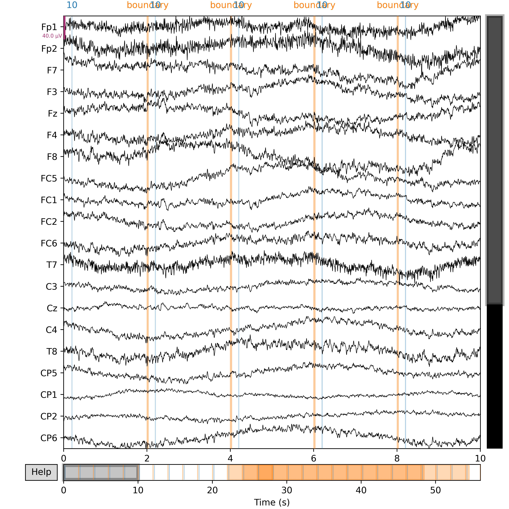

# Spike-EEG-Network

[English](README.md) | 中文(Chinese)
## Data Prepare

请将下载的数据集按照如下的方式进行，以 [KUL Database](https://zenodo.org/records/4004271) 和 [DTU DataBase](https://zenodo.org/records/1199011) 为例：
```
|EEG Database/
├──KUL Dataset/
│  ├── Data
│  │   ├── S1.mat
│  │   ├── S2.mat
│  │   ├── ......
│  ├── ......
├──DTU Dataset/
│  ├── EEG
│  │   ├── S1.mat
│  │   ├── S2.mat
│  │   ├── ......
│  ├── Data_preproc
│  │   ├── ......
│  ├── AUDIO
│  │   ├── ......
|  ├── ......
```

### Data Loader

接下来，我们将借助 EEGLoader.py 将数据集处理，读取到的数据进行训练集和测试集的划分，以便后续网络的输入。
```
from EEGLoader import EEGDataset
path = r'' # EEG 数据的根目录

train_ratio = 0.8 ## train_set 比例
test_ratio = 0.2 ## test_ratio 比例

train_set, test_set = EEGDataset(path, train_ratio, test_ratio)
```

其中 ```train_set``` 的类型为 ```<torchvision.datasets>```。之后，我们将可以通过 ```<torch.utils.data.DataLoader>``` 的方式将处理之后的结果转换为网络可以训练的模式。

```
from torch.utils.data import Dataset,DataLoader

train_loader = DataLoader(dataset=train_dataset, batch_size=32, shuffle=True, num_workers=4, drop_last=True,pin_memory=True)
test_loader=DataLoader(dataset=test_dataset, batch_size=32, shuffle=False, num_workers=4, drop_last=True,pin_memory=True)
```

### Data Show


为了帮助我们更好的理解所读取的数据的形式，我们将展示如何将读取到的EEG Data数据进行展示。
```
import matplot.pyplot as plt
import scipy.io
import mne

# input is EEG Data
EEGShow(train_set[0])

# print EEG's shape: [Batch_size, C, H, W] 
print(train_set[0].shape)

# draw with mne package
raw = mne.io.read_raw_eeglab(filename)
fig = raw.plot(title='EEG Data', show = True)
fig.savefig('result.jpg',dpi = 550)
break
```


## 搭建基于 Spike 神经元 的网络分类端

对于网络编码的结果，我们可以搭建基于脉冲神经元的网络分类架构。具体而言，网络的结构可以表示为：

```
class CSNN(nn.Module):
    def __init__(self, T: int, channels: int, use_cupy=False):
        super().__init__()
        self.T = T
        self.conv_fc = nn.Sequential(
            layer.Conv2d(1, channels, kernel_size=3, padding=1, bias=False),
            layer.BatchNorm2d(channels),
            neuron.IFNode(surrogate_function=surrogate.ATan()),
            layer.MaxPool2d(2, 2),  # 14 * 14

            layer.Conv2d(channels, channels, kernel_size=3, padding=1, bias=False),
            layer.BatchNorm2d(channels),
            neuron.IFNode(surrogate_function=surrogate.ATan()),
            layer.MaxPool2d(2, 2),  # 7 * 7

            layer.Flatten(),
            layer.Linear(channels * 16*16, channels * 4 * 4, bias=False),
            neuron.IFNode(surrogate_function=surrogate.ATan()),

            layer.Linear(channels * 4 * 4, 2, bias=False),
            neuron.IFNode(surrogate_function=surrogate.ATan()),
        )

        functional.set_step_mode(self, step_mode='m')

        if use_cupy:
            functional.set_backend(self, backend='cupy')

    def forward(self, x: torch.Tensor):
        # x.shape = [N, C, H, W]
        x_seq = x.unsqueeze(0).repeat(self.T, 1, 1, 1, 1)  # [N, C, H, W] -> [T, N, C, H, W]
        x_seq = self.conv_fc(x_seq)
        fr = x_seq.mean(0)
        return fr

    def spiking_encoder(self):
        return self.conv_fc[0:3]
```
从而，我们可以借助上述的网络，得到对应的不同时间分辨率下的网络分类结果：


